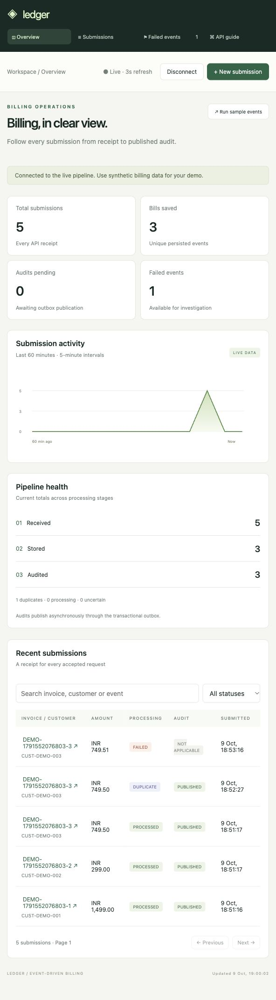
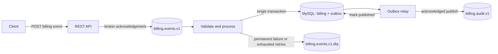

# Ledger — Live Billing Dashboard

**Java 21 · Spring Boot · Kafka · MySQL · Transactional Outbox**

A live billing dashboard backed by a real Java, Kafka, and MySQL pipeline. Submit synthetic bills, follow processing and audit status, and investigate failed events. The dashboard refreshes every three seconds and runs from the same Spring Boot application.

Built by [Vikash Sachan](https://github.com/sachanworks-code). This is an independent demonstration; it contains no employer code or customer data.

## Dashboard

Open **http://localhost:8080/** after starting the stack. Click **Connect workspace** and enter `billing-local-dev-key` for the local demo, or your configured `BILLING_API_KEY`.

- Overview: submission totals, unique stored bills, pending audits, failures, and activity over the last hour.
- Submissions: invoice/customer/event search, status filters, pagination, and receipt timelines.
- New submission: validated billing form, plus three real sample events with one click.
- Receipt details: identical duplicate and conflicting amount demonstrations.
- Failed events: original payload, diagnostic reason, and dead-letter partition/offset.

The UI shell is public; billing data and writes require an API key. Keys remain in browser memory only and disappear on reload/disconnect. There are no fabricated metrics or simulated processing results. API-submitted events have receipts; records sent directly to Kafka can contribute bills/failures without a receipt.



## What this demonstrates

- **Durable acceptance:** HTTP returns `202` only after Kafka acknowledges the input event.
- **Idempotent persistence:** the event ID is a database primary key; concurrent replays produce one billing record and one outbox row.
- **Conflict detection:** the same event ID with a different payload goes to the dead-letter queue.
- **Atomic billing and audit intent:** both rows commit in one MySQL transaction.
- **Recoverable audit delivery:** a polling outbox publishes pending audit events and marks them sent after Kafka acknowledges them.
- **Explicit failure handling:** transient listener failures get two retries; malformed, invalid, or conflicting events go directly to a DLQ.
- **Real integration tests:** Testcontainers starts Kafka and MySQL; tests exercise retries, rollback, concurrent duplicates, and audit replay.

## Architecture



See [architecture and tradeoffs](docs/architecture.md) for the guarantees and their limits.

## Run locally

Requires Docker with Compose. The first build downloads images and Maven dependencies.

```bash
docker compose up --build -d
curl http://localhost:8080/actuator/health
```

Wait for health to return `UP`. Kafka and MySQL have startup health checks; the application starts after both are ready.

```bash
curl -i -X POST http://localhost:8080/api/v1/billing-events \
  -H 'X-API-Key: billing-local-dev-key' \
  -H 'Content-Type: application/json' \
  --data-binary @examples/billing-event.json
```

Response: `202 Accepted`, a `Location` header, and a JSON body containing `eventId`, a distinct `submissionId`, and `status: ACCEPTED`.

```bash
curl -H 'X-API-Key: billing-local-dev-key' http://localhost:8080/api/v1/billing-events/54ea3148-3f35-43e8-a003-668e934cac01
```

The lookup returns `404` until processing commits. Afterwards it returns `PERSISTED`, the event, and an `auditStatus` of `PENDING` or `PUBLISHED`.

Submit the sample again to demonstrate replay: no second billing or outbox row is created. Change the amount while retaining the event ID to demonstrate conflict handling. The submission still returns `202`; the asynchronous consumer sends that conflict to the DLQ and preserves the original record.

### Inspect audit and failed events

```bash
docker compose exec kafka /opt/kafka/bin/kafka-console-consumer.sh \
  --bootstrap-server kafka:19092 --topic billing.audit.v1 --from-beginning

docker compose exec kafka /opt/kafka/bin/kafka-console-consumer.sh \
  --bootstrap-server kafka:19092 --topic billing.events.v1.dlq --from-beginning
```

Use Ctrl+C to stop each consumer. The DLQ contains the original message with Spring Kafka exception and source-record headers. There is no automatic DLQ replay: inspect and correct a failed event before publishing it again.

```bash
docker compose logs -f app
docker compose down
```

`down` preserves the MySQL volume. Kafka is ephemeral in this local demo. Recreating the stack loses Kafka history while retaining MySQL records; use a new event ID for a fresh example.

### Run the app from source

Requires JDK 21; the Maven wrapper downloads Maven automatically.

```bash
docker compose up -d mysql kafka
./mvnw spring-boot:run
```

Do not also run the Compose `app` service on port 8080.

## Tests

```bash
./mvnw test       # fast contract and API tests; no Docker required
./mvnw verify     # all tests, including real Kafka/MySQL containers
```

Docker must be running for `verify`. Integration tests deliberately fail when Docker is unavailable rather than silently skipping. Test reports are under `target/surefire-reports` and `target/failsafe-reports`; GitHub Actions runs the same verification and uploads those reports.

Covered failure scenarios:

- Invalid API input never reaches Kafka; a failed broker send returns `503`.
- A duplicate or concurrent delivery produces one persisted event.
- A conflicting replay and malformed JSON reach the DLQ.
- Transient processing failures recover after retry; exhausted retries reach the DLQ.
- An outbox insert failure rolls back the billing insert.
- An audit send failure leaves the outbox pending for the next attempt.
- A failure after Kafka acknowledgement can replay an audit event with the same stable ID.

## API and load demonstration

- [OpenAPI contract](docs/openapi.yml)
- [Example request](examples/billing-event.json)
- [Operational notes](docs/operations.md)
- [Recorded local verification](docs/verification.md)

Run a small synthetic load check against the running stack:

```bash
python3 scripts/load_demo.py --events 100 --concurrency 8
```

It measures HTTP acceptance latency and waits for persistence plus audit publication. The output distinguishes accepted from fully processed events. This is a local demonstration, not a production capacity claim.

## Delivery guarantees

**Input processing and audit publication are at least once.** Database idempotency gives one stored billing record **per event ID**. Downstream audit consumers must deduplicate using `auditId`. Two different event IDs referencing the same invoice are treated as two distinct events; invoice-level business uniqueness is outside this demo.

`202` means accepted into Kafka, not persisted or audited. After a `503` or client timeout, retry the identical payload with the same event ID because delivery may have succeeded.

## Scope

Local demo credentials and plaintext Kafka are confined to loopback ports. API-key authentication is included. Before hosting externally, replace all local credentials, configure HTTPS, persist Kafka storage, keep database/broker ports private, and add retention, backups, rate limits, and monitoring appropriate to the host. See [dashboard operations](docs/dashboard.md). No production throughput or availability is claimed.

## Technology versions

Java 21, Spring Boot 3.5.16, Kafka 3.9.1, MySQL 8.4, and Testcontainers 2.0.5. Spring Boot manages the application dependency versions. The Kafka broker version is separate from the managed Java client version.

## License

[MIT](LICENSE)
